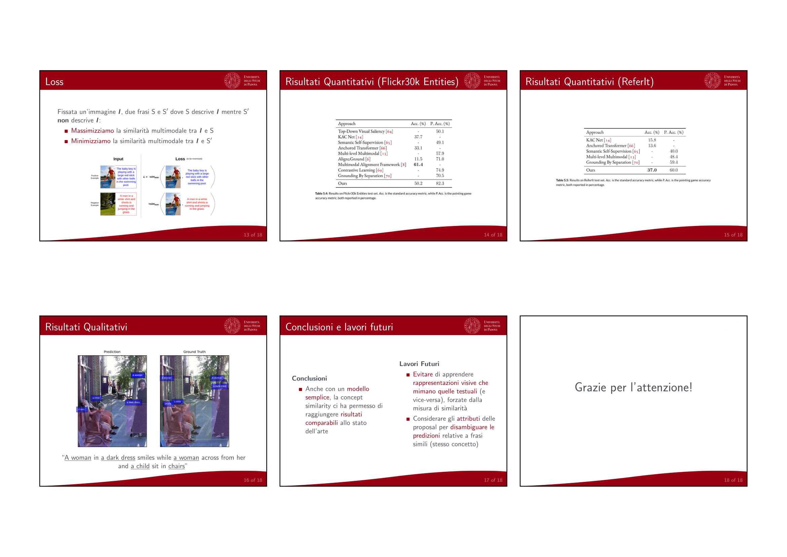

# Weakly Supervised Visual-Textual Grounding based on Concept Similarity

## [Download](https://github.com/lparolari/master-thesis-presentation/releases/latest/download/presentation.pdf)

* Read the [presentation](https://github.com/lparolari/master-thesis-presentation/releases/latest/download/presentation.pdf), or
* Read my [thesis](https://github.com/lparolari/master-thesis/releases/latest/download/thesis.pdf).

You may want to browse the code for my [thesis model implementation](https://github.com/lparolari/weakvtg).

## Abastract

We address the problem of phrase grounding, i.e. the task of locating
the content of the image referenced by the sentence, by using weak
supervision. Phrase grounding is a challenging problem that requires
joint understanding of both visual and textual modalities, while being
an important application in many field of study such as visual
question answering, image retrieval and robotic navigation. We propose
a simple model that leverages on concept similarity, i.e. the
similarity between a concept in phrases and the proposal bounding
boxes label. We apply such measure as a prior on our model prediction.
Then the model is trained to maximize multimodal similarity between an
image and a sentence describing that image, while minimizing instead
the multimodal similarity between the image and a sentence not
describing the image. Our experiments shows comparable performance
with respect to State-of-the-Art works.

## Example




## Usage

```
pdflatex presentation.tex
```

## Related Works

* [weakvtg](https://github.com/lparolari/weakvtg), PyTorch model
  implementation.
* [master-thesis](https://github.com/lparolari/master-thesis), thesis
  dissertation (LaTeX source code + artifacts).
* [master-thesis-presentation](https://github.com/lparolari/master-thesis-presentation),
  thesis presentation + talk (LaTex source code + artifacts).
* [master-thesis-report](https://github.com/lparolari/master-thesis-report),
  quasi-final thesis report (LaTeX source code + artifacts).
* [master-thesis-log](https://github.com/lparolari/master-thesis-log),
  contains scripts, notebooks, notes, todos and logs about the thesis.

## Acknowledgements

* [Burattin's UNIPD Latex Beamer Theme](https://www.math.unipd.it/~burattin/other/tema-latex-beamer-padova/)

## Author

Luca Parolari

- Email: [luca.parolari23@gmail.com](mailto:luca.parolari23@gmail.com)
- GitHub: [@lparolari](https://github.com/lparolari)
- Telegram: [@lparolari](https://t.me/lparolari)

## License

MIT